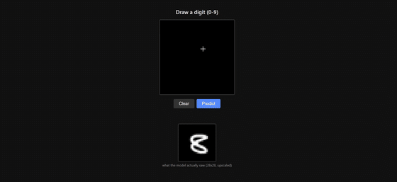
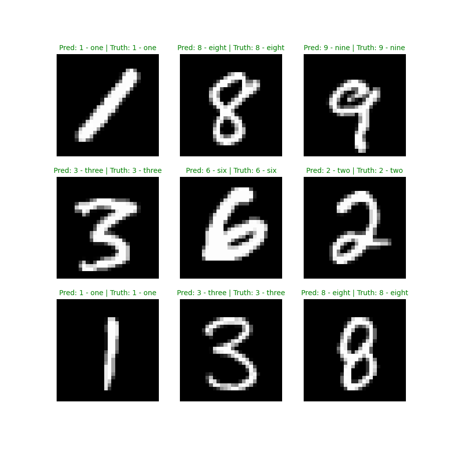
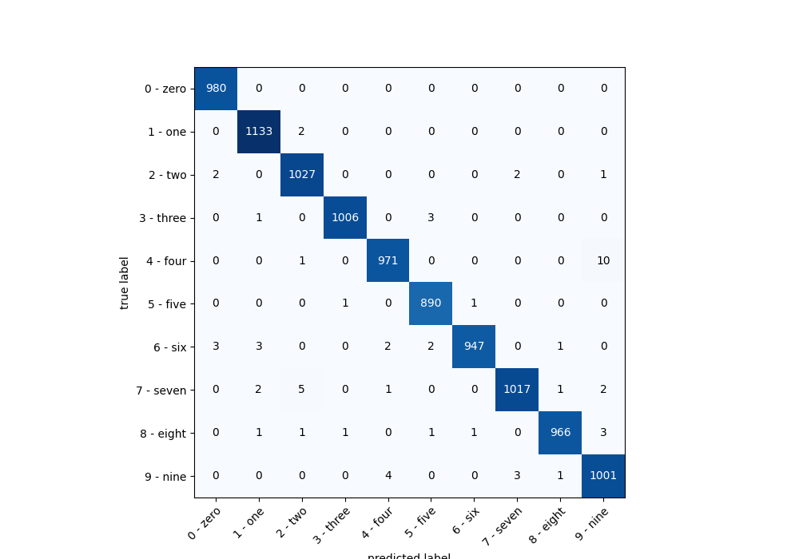

Draw a digit (0-9) in the browser and get a live prediction from a PyTorch CNN, trained
on MNIST and served through a FastAPI backend running in Docker.

**Live demo:** https://digitsdeeplearning.onrender.com/
(free tier — spins down after ~15 min idle, first request after that takes 30-60s to wake up)

## Demo



([full-quality video](demo.mp4))

## The model

Two CNNs are trained and served side by side:

- **`MNIST_v2`**  a baseline CNN: two convolutional blocks (`Conv2d → ReLU → Conv2d → ReLU → MaxPool2d`,
  120 channels), followed by a linear classifier.
- **`MNIST_v3`**  the same architecture plus `Dropout2d` in every block, trained with
  random affine augmentation (rotation + translation) so it generalizes better to
  hand-drawn digits instead of just MNIST's clean, centered training images.

`MNIST_v3` reaches **~99.4% accuracy** on the MNIST test set.

### Sample predictions



### Confusion matrix



## What I'm learning

This project started as a single notebook and was deliberately rebuilt piece by piece to learn:

- **Going modular** splitting a notebook into `data_setup.py` (datasets/dataloaders),
  `model.py` (architecture only, no training logic baked in), `engine.py` (reusable
  `train_step`/`test_step` functions), and `train.py` (the script that wires it all
  together and saves weights) — instead of one long notebook that's hard to reuse or run
  outside itself.
- **PyTorch fundamentals**  CNNs, `Dropout2d` for regularizing conv feature maps,
  `torchmetrics` for accuracy tracking, and data augmentation (`RandomAffine`) to close
  the gap between clean training data and messy real-world input.
- **Docker**  writing a `Dockerfile` from scratch, understanding image layers and build
  caching (ordering `COPY`/`RUN` so dependency installs aren't repeated on every code
  change), and keeping the image lean with a CPU-only PyTorch build instead of the
  default CUDA one.
- **Deployment**  taking something that only ran in a notebook on one machine and
  making it a real, reachable web app: a FastAPI backend, a canvas-based frontend, and
  a container that runs identically locally and on [Render](https://render.com), the
  hosting platform it's deployed to.

## Project structure

```
data_setup.py    # datasets + dataloaders
model.py         # MNIST_v2 / MNIST_v3 architectures
engine.py        # train_step / test_step
train.py         # trains MNIST_v3 and saves model/mnist_v3.pth
inference.py     # sample predictions + confusion matrix (the images above)
app/main.py      # FastAPI backend, /predict endpoint
app/static/      # canvas UI
Dockerfile       # containerized deployment
```
